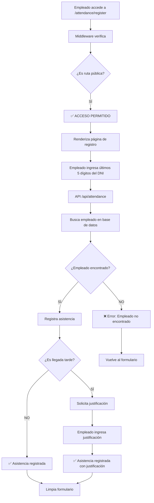

# 🔄 DIAGRAMA DE FLUJO: /LOGIN vs /ATTENDANCE/REGISTER

## 📋 RESUMEN EJECUTIVO

Ambas rutas usan el **mismo middleware**, pero tienen **propósitos completamente diferentes** y **flujos de autenticación distintos**.

---

## 🛡️ **RUTA: /LOGIN** (Autenticación de Administradores)

### 🎯 **Propósito**
- **Acceso administrativo** al sistema
- **Autenticación de usuarios** con email y contraseña
- **Gestión de sesiones** de Supabase
- **Redirección al dashboard** después del login

### 🔄 **Flujo del Middleware**

```mermaid
graph TD
    A[Usuario accede a /login] --> B[Middleware verifica]
    B --> C{¿Es ruta pública?}
    C -->|SÍ| D[✅ ACCESO PERMITIDO]
    D --> E[Renderiza página de login]
    E --> F[Usuario ingresa credenciales]
    F --> G[useAuth.login()]
    G --> H[Supabase Auth]
    H --> I{¿Credenciales válidas?}
    I -->|SÍ| J[✅ Sesión creada]
    I -->|NO| K[❌ Error de credenciales]
    J --> L[Redirige a /dashboard]
    K --> M[Vuelve a /login]
```

### 📝 **Características Específicas**

#### **Autenticación**
- ✅ **Requiere email y contraseña**
- ✅ **Usa Supabase Auth**
- ✅ **Crea sesión persistente**
- ✅ **Redirige al dashboard**

#### **Componentes**
- `useAuth()` hook para gestión de estado
- Formulario de login con validación
- Manejo de errores de autenticación
- Redirección automática si ya está logueado

#### **Seguridad**
- 🔒 **Sesión persistente** (cookies)
- 🔒 **Protección de rutas** después del login
- 🔒 **Validación de credenciales** en Supabase

---

## ⏰ **RUTA: /ATTENDANCE/REGISTER** (Registro de Asistencia Pública)

### 🎯 **Propósito**
- **Registro de asistencia** para empleados
- **Acceso público** sin autenticación
- **Marcado de entrada/salida** por DNI
- **Sistema de justificaciones** para tardanzas

### 🔄 **Flujo del Middleware**



### 📝 **Características Específicas**

#### **Autenticación**
- ❌ **NO requiere login**
- ✅ **Identificación por DNI**
- ✅ **Acceso público**
- ✅ **Sin sesión persistente**

#### **Componentes**
- `AttendanceManager` para lógica de negocio
- Formulario simple con DNI
- Sistema de justificaciones
- API calls directos sin autenticación

#### **Seguridad**
- 🔓 **Acceso público** (sin autenticación)
- 🔓 **Identificación por DNI** (no sesión)
- 🔓 **Sin protección de rutas**

---

## 🔍 **COMPARACIÓN DETALLADA**

| Aspecto | `/login` | `/attendance/register` |
|---------|----------|------------------------|
| **Propósito** | Autenticación administrativa | Registro de asistencia pública |
| **Usuarios** | Administradores | Empleados |
| **Autenticación** | Email + Contraseña | Últimos 5 dígitos del DNI |
| **Sesión** | Persistente (cookies) | Sin sesión |
| **Protección** | Ruta pública (acceso libre) | Ruta pública (acceso libre) |
| **Redirección** | A `/dashboard` | Sin redirección |
| **Estado** | Global (useAuth) | Local (componente) |
| **API Calls** | Supabase Auth | API REST directa |
| **Seguridad** | Alta (sesión) | Media (identificación) |

---

## 🛡️ **MIDDLEWARE: Comportamiento Unificado**

### ✅ **Ambas rutas usan el mismo middleware**

```typescript
// Middleware verifica para ambas rutas:
const PUBLIC_ROUTES = new Set([
  '/login',                    // ← Ruta administrativa
  '/attendance/register',      // ← Ruta pública
  // ... otras rutas
])

// Flujo unificado:
if (isPublicRoute(pathname)) {
  // ✅ ACCESO PERMITIDO para ambas
  return NextResponse.next()
}
```

### 🔄 **Diferencias en el procesamiento**

#### **Para /login:**
1. Middleware permite acceso ✅
2. Página renderiza formulario de login
3. Usuario ingresa credenciales
4. `useAuth.login()` crea sesión Supabase
5. Redirige al dashboard

#### **Para /attendance/register:**
1. Middleware permite acceso ✅
2. Página renderiza formulario de asistencia
3. Usuario ingresa DNI
4. API directa sin autenticación
5. Registra asistencia en base de datos

---

## 🎯 **CONCLUSIONES**

### **Similitudes**
- ✅ **Ambas son rutas públicas** (no requieren autenticación)
- ✅ **Usan el mismo middleware**
- ✅ **Acceso directo** sin redirecciones

### **Diferencias Clave**
- 🔄 **Propósito**: Admin vs Empleado
- 🔄 **Autenticación**: Sesión vs Identificación
- 🔄 **Persistencia**: Cookies vs Sin sesión
- 🔄 **Flujo**: Dashboard vs Registro directo

### **Seguridad**
- 🔒 **Login**: Alta seguridad con sesiones
- 🔓 **Attendance**: Seguridad media con identificación

El middleware actúa como **portero unificado** que permite acceso a ambas rutas, pero cada una maneja su propia lógica de autenticación y flujo de negocio. 