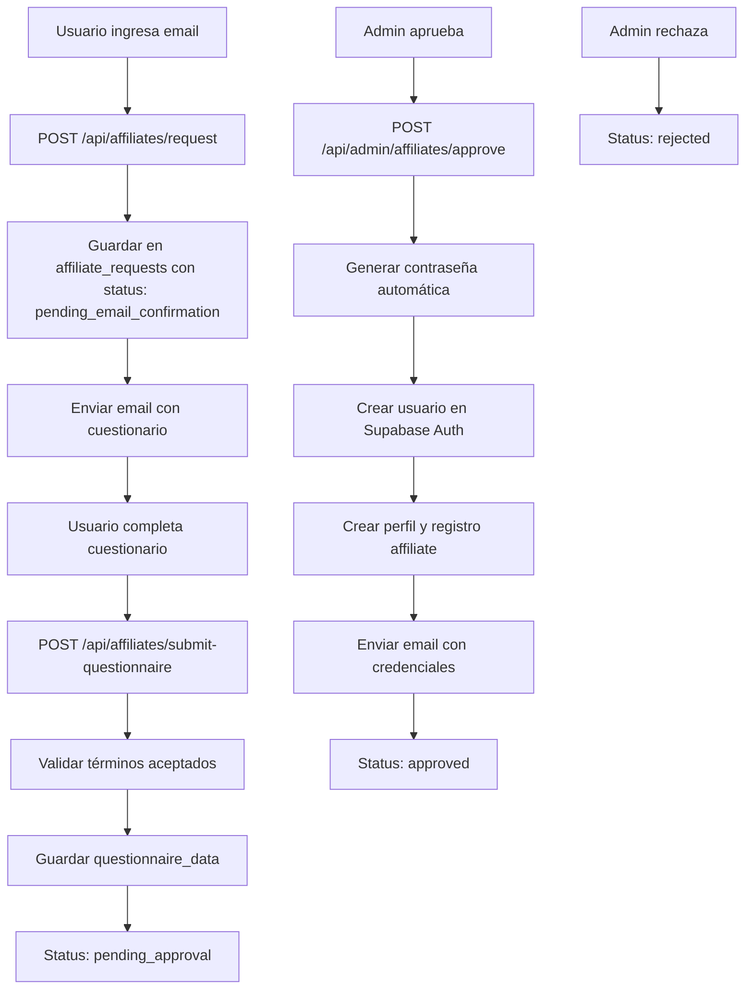

# Plan: Programa de Afiliados sin Autenticación Inicial (Similar a Mail List)

## Objetivo
Transformar el programa de afiliados para que funcione como el sistema de mail list subscription: usuario solo deja email inicialmente, recibe cuestionario/formulario, acepta términos, y luego se crea la cuenta.

## Flujo Actual vs Nuevo Flujo

### Flujo Actual (con auth inmediata)
1. Usuario completa formulario con nombre, email, password
2. Se crea usuario en Supabase Auth inmediatamente
3. Se crea perfil y registro de afiliado con status 'pending'
4. Admin aprueba/rechaza

### Nuevo Flujo (sin auth inicial)
1. Usuario solo ingresa email
2. Sistema guarda solicitud con status 'pending_email_confirmation'
3. Usuario recibe email con cuestionario/formulario de afiliación
4. Usuario completa cuestionario y acepta términos
5. Admin aprueba/rechaza la solicitud de afiliado
6. Si aprobado: Sistema crea usuario y contraseña automáticamente
7. Usuario recibe credenciales por email

## Arquitectura

## Componentes a Crear/Modificar

### 1. Base de Datos
**Archivo**: `supabase/migrations/[timestamp]_affiliate_requests.sql`

**Nueva tabla `affiliate_requests` (similar a mail_list_subscriptions):**
- `id` (UUID, PK)
- `email` (TEXT, UNIQUE, NOT NULL)
- `confirmation_token` (TEXT, UNIQUE) - para cuestionario
- `status` (ENUM: 'pending_email_confirmation', 'pending_approval', 'approved', 'rejected')
- `questionnaire_data` (JSONB) - respuestas del cuestionario
- `terms_accepted` (BOOLEAN)
- `terms_accepted_at` (TIMESTAMPTZ)
- `user_id` (UUID, NULLABLE) - FK a auth.users cuando se crea cuenta
- `affiliate_id` (UUID, NULLABLE) - FK a affiliates cuando se aprueba
- `source` (TEXT) - origen de la solicitud
- `metadata` (JSONB)
- `created_at` (TIMESTAMPTZ)
- `updated_at` (TIMESTAMPTZ)

**Modificar tabla `affiliates`:**
- Hacer `user_id` NULLABLE (inicialmente puede ser NULL hasta que se apruebe)
- Agregar `affiliate_request_id` (UUID, FK a affiliate_requests)

### 2. API Endpoints

**Archivo**: `pages/api/affiliates/request.ts` (nuevo, basado en mail-list/subscribe.ts)
- POST endpoint para solicitar afiliación (solo email)
- Rate limiting
- Generar confirmation_token
- Guardar en affiliate_requests con status 'pending_email'
- Enviar email con cuestionario

**Archivo**: `pages/api/affiliates/submit-questionnaire.ts` (nuevo)
- POST endpoint para enviar cuestionario completado
- Validar token
- Validar que términos fueron aceptados
- Guardar questionnaire_data en affiliate_request
- Actualizar status a 'pending_approval'
- NO crear usuario todavía (eso ocurre cuando admin aprueba)

**Archivo**: `pages/api/affiliates/register.ts` (modificar)
- Deprecar o mantener para compatibilidad
- O redirigir a nuevo flujo

### 3. Email Templates

**Archivo**: `lib/emails/affiliate-questionnaire.ts` (nuevo, basado en mail-list-confirmation.ts)
- Email con link al cuestionario
- Incluir información del programa
- Link para completar cuestionario: `${siteUrl}/afiliados/questionnaire?token=${token}`

**Archivo**: `lib/emails/affiliate-credentials.ts` (nuevo)
- Email con credenciales después de que admin aprueba
- Incluir email y contraseña generada
- Link para iniciar sesión
- Instrucciones de uso
- Instrucciones para cambiar contraseña

### 4. Componentes UI

**Archivo**: `pages/afiliados.tsx` (modificar)
- Cambiar formulario: solo campo email inicialmente
- Después de enviar email, mostrar mensaje de confirmación
- Redirigir a página de cuestionario cuando llegue email

**Archivo**: `pages/afiliados/questionnaire.tsx` (nuevo)
- Página con formulario de cuestionario
- Campos: nombre completo, información profesional, cómo conociste el programa, etc.
- Checkbox para aceptar términos y condiciones
- Botón para enviar cuestionario
- Validación de términos aceptados

**Archivo**: `pages/afiliados/confirm.tsx` (nuevo)
- Página de confirmación después de enviar cuestionario
- Mensaje: "Tu solicitud ha sido enviada. La revisaremos y te contactaremos pronto."
- Mensaje: "Si tu solicitud es aprobada, recibirás un email con tus credenciales de acceso."

### 5. Páginas de Admin

**Archivo**: `pages/app/admin/affiliates.tsx` (modificar)
- Agregar vista de affiliate_requests pendientes
- Permitir aprobar/rechazar solicitudes
- Al aprobar, llamar endpoint que crea usuario y envía credenciales

**Archivo**: `pages/api/admin/affiliates/approve.ts` (nuevo)
- POST endpoint para aprobar solicitud de afiliado
- Validar que admin está autenticado
- Validar que request está en status 'pending_approval'
- Generar contraseña automática
- Crear usuario en Supabase Auth
- Crear perfil y registro de afiliado
- Actualizar affiliate_request con user_id y affiliate_id
- Enviar email con credenciales
- Actualizar status a 'approved'

**Archivo**: `pages/api/admin/affiliates/reject.ts` (nuevo)
- POST endpoint para rechazar solicitud de afiliado
- Validar que admin está autenticado
- Actualizar status a 'rejected'
- Opcional: enviar email de rechazo

### 6. Migración de Datos

**Archivo**: `supabase/migrations/[timestamp]_migrate_existing_affiliates.sql`
- Script para migrar affiliates existentes a nuevo sistema
- Crear affiliate_requests para affiliates existentes

## Flujo Detallado

### Paso 1: Solicitud Inicial
1. Usuario visita `/afiliados`
2. Ingresa solo su email
3. POST `/api/affiliates/request` con email
4. Sistema guarda en `affiliate_requests` con status 'pending_email'
5. Sistema envía email con link al cuestionario

### Paso 2: Completar Cuestionario
1. Usuario hace clic en link del email
2. Llega a `/afiliados/questionnaire?token=xxx`
3. Completa formulario con información adicional
4. Acepta términos y condiciones
5. POST `/api/affiliates/submit-questionnaire` con token, datos y términos aceptados
6. Sistema guarda questionnaire_data en affiliate_request
7. Sistema actualiza status a 'pending_approval'
8. Usuario ve mensaje de confirmación: "Tu solicitud será revisada"

### Paso 3: Aprobación Admin
1. Admin ve solicitud en panel de admin
2. Admin revisa questionnaire_data
3. Admin aprueba → POST `/api/admin/affiliates/approve` con request_id
4. Sistema genera contraseña automática
5. Sistema crea usuario en Supabase Auth
6. Sistema crea perfil y registro de afiliado
7. Sistema actualiza affiliate_request con user_id y affiliate_id
8. Sistema envía email con credenciales
9. Status cambia a 'approved'
10. Si admin rechaza → Status cambia a 'rejected' (sin crear cuenta)

## Consideraciones

### Seguridad
- Rate limiting en todos los endpoints públicos
- Tokens únicos y seguros
- Validación de términos aceptados obligatoria
- Contraseñas generadas automáticamente (seguras, aleatorias, 16+ caracteres)
- No exponer si email ya existe
- Endpoints de admin requieren autenticación y rol de admin
- Validar que request está en estado correcto antes de aprobar/rechazar

### UX
- Mensajes claros en cada paso
- Email con instrucciones claras
- Cuestionario simple y directo
- Confirmación visual después de cada acción

### Compatibilidad
- Mantener endpoint `/api/affiliates/register` para compatibilidad (opcional)
- Migrar affiliates existentes al nuevo sistema

## Preguntas para Clarificar

1. ¿Qué información debe incluir el cuestionario? Rhace uno generico por ahora)
2. ¿Dónde están los términos y condiciones del programa de afiliados? hace uno generico por ahora pero tenes referencia en /afiliados 
3. ¿Cómo se genera la contraseña? (longitud, complejidad, formato)
4. ¿El email de credenciales debe incluir instrucciones de cambio de contraseña?
5. ¿Qué pasa si un usuario ya tiene cuenta pero quiere ser afiliado? se incluye no debe haber problema

