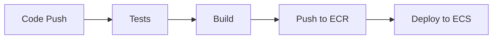

# SAAS-RH Project Documentation

## Overview
SAAS-RH is a Human Resources management system built as a microservices architecture, handling employee attendance, payroll, and basic HR data management.

## Quick Start

### Prerequisites
- AWS Account with appropriate permissions
- Terraform installed (v1.0+)
- Docker and Docker Compose
- Node.js (v18+)
- Domain name for the application

### Initial Setup
1. Clone the repository
2. Set up AWS credentials
3. Configure environment variables
4. Run infrastructure deployment
```bash
cd terraform
terraform init
terraform apply
```

### Environment Variables
Create `.env` files for each service with these variables:

```env
# Database
DB_HOST=<rds-endpoint>
DB_PORT=5432
DB_NAME=saas_db
DB_USER=admin
DB_PASSWORD=<from-secrets>

# Redis
REDIS_HOST=<elasticache-endpoint>
REDIS_PORT=6379
REDIS_PASSWORD=<from-secrets>

# Security
NODE_ENV=production
SESSION_SECRET=<generated-secret>
CORS_ORIGIN=https://app.yourdomain.com

# AWS
AWS_REGION=us-west-2
```

## Architecture

### Infrastructure Components
- VPC with public/private subnets
- ECS for container orchestration
- RDS PostgreSQL for database
- ElastiCache Redis for sessions
- Application Load Balancer
- CloudWatch for monitoring

### Services
1. bases_de_datos: Core employee data management
2. asistencia: Attendance tracking
3. nomina: Payroll management

## Security

### Implemented Measures
- SSL/TLS encryption
- WAF protection
- Security headers
- Rate limiting
- Input validation
- Session management
- Automated backups

### Access Control
- ALB handles SSL termination
- Services in private subnets
- Security groups limit access
- Session-based authentication

## Monitoring

### Key Metrics
- Response times
- Error rates
- CPU/Memory usage
- Database connections
- Request counts

### Alerts
Configured for:
- High error rates
- Service unavailability
- Database issues
- Memory pressure

## Backup & Recovery

### Automated Backups
- Daily RDS snapshots
- Weekly full backups
- 90-day retention
- Encrypted storage in S3

### Recovery Procedure
1. Access AWS Console
2. Navigate to RDS
3. Select snapshot
4. Initiate restore
5. Update DNS if needed

## Deployment

### CI/CD Pipeline


### Rollback Procedure
```bash
# Using GitHub Actions
gh workflow run rollback.yml -f version=<commit-sha>
```

## Troubleshooting

### Common Issues
1. Service Unhealthy
```bash
# Check service logs
aws logs get-log-events --log-group-name /saas-rh/<service-name>
```

2. Database Connection Issues
```bash
# Verify connectivity
curl -f http://localhost:3000/health
```

3. High Error Rates
- Check CloudWatch metrics
- Review error logs
- Verify security group rules

### Support Contacts
- Infrastructure: devops@company.com
- Application: dev@company.com
