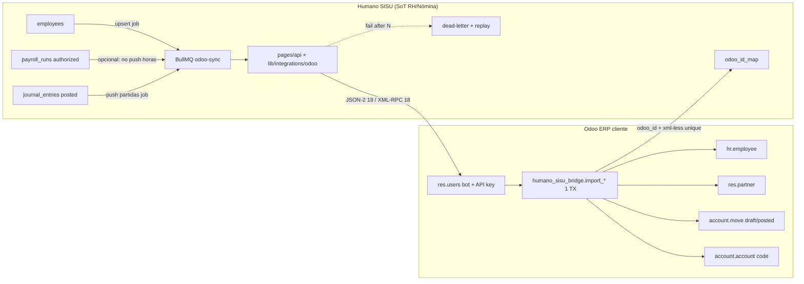

# Plan de integración Humano SISU ↔ Odoo

**Rol:** arquitectura de integración ERP/HR. **No es implementación.**  
**Fecha de investigación:** 2026-08-25.  
**Hipótesis:** cliente opera Odoo como ERP (compras, inventario, contabilidad, partners) y SISU como sistema de registro de RH / asistencia / nómina local. **Validada** por el patrón oficial Employment Hero (nómina fuera de Odoo; asientos en Odoo). **Refutada** si el cliente espera que `hr.payroll` de Odoo calcule IHSS/ISR/RAP.

Fuentes primarias: documentación Odoo 19.0 y código `odoo/odoo` rama `19.0`. Extraoficial (OCA, App Store, foros) solo para contrastar.

---

## A. Hallazgos de investigación

### A.1 Versión Odoo recomendada

| Versión | Release | Fin soporte estándar (oficial) | API externa | Relevancia SISU |
|---|---|---|---|---|
| **19.0** | Sep 2025 | Sep 2028 (planificado) | **JSON-2** (`/json/2/{model}/{method}`) | **Target de diseño** para addon + conector nuevo |
| **18.0** | Oct 2024 | Sep 2027 (planificado) | XML-RPC / JSON-RPC (aún vigentes) | **Compatibilidad** (LATAM on-prem suele ir 1 versión atrás) |
| 17.0 | Nov 2023 | **Sep 2026** (planificado) | XML-RPC | **Fuera de alcance.** EOS inminente a la fecha de este plan |

Fuente: [Standard and extended support — 19.0](https://www.odoo.com/documentation/19.0/administration/standard_extended_support.html).

**Justificación:** JSON-2 es *New in version 19.0*. XML-RPC/JSON-RPC en `/xmlrpc`, `/xmlrpc/2`, `/jsonrpc` están deprecados; retiro programado en Odoo 22 (otoño 2028). El servicio `db` ya se retiró en Odoo 20 / Online 19.1.

**Decisión de producto (no cerrada en silencio):** el conector SISU debe versionar el transporte (`json2` | `xmlrpc`) por conexión. El **addon** se versiona 18.0 y 19.0 (misma API de negocio, distinta API HTTP). No diseñar sobre 17.

### A.2 API externa (oficial)

Fuente: [External JSON-2 API — 19.0](https://www.odoo.com/documentation/19.0/developer/reference/external_api.html).

- **Endpoint:** `POST /json/2/{model}/{method}`.
- **Auth:** header `Authorization: bearer <API_KEY>` (el doc usa `bearer` en minúsculas). **No** uid+password en JSON-2.
- **DB:** `X-Odoo-Database` solo si un host sirve varias bases.
- **Cuerpo:** argumentos **nombrados** + `ids` + `context`. No hay args posicionales.
- **Transacción:** **una llamada = una transacción SQL**. No se pueden encadenar `create` + `action_post` en la misma transacción desde el cliente. Si hay que crear asiento **y** líneas **y** idempotencia, Odoo recomienda **un método de negocio en un módulo dedicado**.
- **ACL:** JSON-2 usa los mismos access rights, record rules y field groups del usuario de la API key.
- **Bot user:** cuenta dedicada, password vacío (sin login UI), permisos mínimos.
- **API keys:** duración máxima **3 meses**; rotación obligatoria. Generación UI: Preferences → Account Security → New API Key. Métodos RPC: `res.users.apikeys/generate` y `revoke`.
- **Odoo Online:** acceso a API externa **solo en planes Custom**. No disponible en One App Free ni Standard. Fuente: misma página JSON-2 + [External RPC API saas-19.2](https://www.odoo.com/documentation/saas-19.2/developer/reference/external_rpc_api.html).

**No verificado en docs oficiales:** rate limits HTTP, tamaño máximo de batch `create`, default `limit` de `search_read`. Tratar como desconocido: el conector debe paginar y backoff ante 429/5xx **si aparecen**; no asumir un QPS.

XML-RPC 18.x (legacy, aún necesario para clientes 18): `xmlrpc/2/common` (`authenticate` → uid) + `xmlrpc/2/object` (`execute_kw`). Password **o** API key como password. Stateless: db+uid+pass en cada call.

### A.3 Community vs Enterprise (módulos relevantes)

Fuentes oficiales:

- [Accounting and Invoicing — 19.0](https://www.odoo.com/documentation/19.0/applications/finance/accounting.html): Invoicing (standalone) vs Accounting (reportes, conciliación, presupuestos, activos).
- [Payroll — 19.0](https://www.odoo.com/documentation/19.0/applications/hr/payroll.html): app Payroll usa contratos, work entries, Attendances/Planning/Timesheets.
- [Employees — 19.0](https://www.odoo.com/documentation/19.0/applications/hr/employees.html).
- Foro Odoo (staff, contrastar): Invoicing técnico = `account` (Community); Accounting app = `account_accountant` (Enterprise). Lista de ediciones: [odoo.com/page/editions](https://www.odoo.com/page/editions) (tabla UI, no dump técnico).

| Capacidad | Community | Enterprise | Implicación SISU |
|---|---|---|---|
| Empleados `hr.employee`, depts `hr.department` | Sí (`hr`) | Sí | Sync master data **no** requiere Enterprise |
| Partners `res.partner`, bancos `res.partner.bank` | Sí (`base`) | Sí | Sync bancos opcional |
| Asientos `account.move` / líneas | Sí (`account` Invoicing; grupo “Full Accounting Features” en Community) | Accounting app completa | **Push de partidas es viable en Community** si el cliente tiene Invoicing + features contables |
| App Accounting (reportes, bank sync, budgets) | No (`account_accountant`) | Sí | El cliente ERP típico **sí** la tiene; el conector no depende de ella para `create` de `entry` |
| Payroll `hr.payslip` / localizaciones | **No** (Enterprise) | Sí, **sin HN/SV/GT** | **No usar.** Confirma SISU como SoT de nómina |
| Attendances biométrico avanzado | Básico Community; avanzado Enterprise (fuentes de partners; **no verificado** campo a campo en docs 19) | — | **Fuera de alcance** (Hikvision vive en SISU) |
| Studio webhooks inbound/outbound | Studio = Enterprise | Sí | [Webhooks — Studio 19.0](https://www.odoo.com/documentation/19.0/applications/studio/automated_actions/webhooks.html). No depender de Studio para el MVP; el conector SISU llama JSON-2 |
| API externa en Odoo Online | Plan Custom | Plan Custom | Discovery comercial: ¿on-prem / odoo.sh / Online Custom? |

### A.4 Modelos Odoo relevantes (solo lo citado en docs o `odoo/odoo` 19.0)

| Modelo | Uso | Notas |
|---|---|---|
| `res.partner` | Contacto; `hr.employee` usa work contact | JSON-2 ejemplos oficiales usan este modelo |
| `hr.employee` | Ficha empleado. `_name = 'hr.employee'` en [hr_employee.py 19.0](https://github.com/odoo/odoo/blob/19.0/addons/hr/models/hr_employee.py) | `work_email`, `barcode` (Badge ID), `bank_account_ids` |
| `hr.version` | En 19, **Identification No** (`identification_id`) está en versión de empleado, groups `hr.group_hr_user` | [hr_version.py](https://github.com/odoo/odoo/blob/19.0/addons/hr/models/hr_version.py). UI: [New employees](https://www.odoo.com/documentation/19.0/applications/hr/employees/new_employee.html) (“Identification No”). **Verificar en `/doc` del tenant si el campo es related escribible en `hr.employee`** |
| `hr.department` | Organigrama | Relación típica `department_id` en employee (presente en código 19; confirmar writability vía `/doc`) |
| `account.move` | Asiento. `move_type` default `'entry'`; `state`: `draft` \| `posted` \| `cancel`; `journal_id`; `line_ids` One2many; `action_post()` → `_post` | [account_move.py 19.0](https://github.com/odoo/odoo/blob/19.0/addons/account/models/account_move.py). Tutorial: [Interact with other modules](https://www.odoo.com/documentation/19.0/developer/tutorials/server_framework_101/13_other_module.html) — `create` + `Command.create` en un solo dict |
| `account.move.line` | Líneas debe/haber | Vía `line_ids` en el `create` del move (una transacción) |
| `account.account` | Plan de cuentas | Match por `code` + `company_id` (convención Employment Hero: mismo code) |
| `account.journal` | Diario miscellaneous para nómina | [Journals](https://www.odoo.com/documentation/19.0/applications/finance/accounting/get_started/journals.html): miscellaneous = asientos no venta/compra |
| `account.analytic.account` | Analítica / centros de costo Odoo | **Opcional fase 2.** Mapping desde `cost_center_type` SISU (`ventas` \| `administracion` \| `produccion`) |
| `hr.payslip` | Payslip Enterprise | **No usar.** No hay localización HN/SV/GT |
| `ir.model.data` | xml_id ↔ id | [Define module data](https://www.odoo.com/documentation/19.0/developer/tutorials/define_module_data.html). Para IDs SISU preferir campo dedicado + unique, no spam de xmlids runtime |
| `ir.model.access` / `ir.rule` | ACL / record rules | [Security intro](https://www.odoo.com/documentation/19.0/developer/tutorials/server_framework_101/04_securityintro.html), [Restrict access](https://www.odoo.com/documentation/19.0/developer/tutorials/restrict_data_access.html) |
| `res.users.apikeys` | Rotación de keys | JSON-2 docs |

**Multi-company oficial:** cada compañía tiene su propio plan de cuentas; un usuario trabaja **una** compañía a la vez en contabilidad. [Accounting 19.0 — Multi-company](https://www.odoo.com/documentation/19.0/applications/finance/accounting.html). En JSON-2 el `context` puede llevar compañía; **el nombre exacto del key de context (`allowed_company_ids`) no está en la página JSON-2** → marcar **no verificado**; confirmar en `/doc` + prueba en staging.

### A.5 Localización fiscal vs payroll

**Fiscal (contabilidad / facturación):**

- Lista oficial incluye **Honduras**. [Fiscal localizations — 19.0](https://www.odoo.com/documentation/19.0/applications/finance/fiscal_localizations.html).
- Módulo core: `l10n_hn` en [github.com/odoo/odoo/addons/l10n_hn @ 19.0](https://github.com/odoo/odoo/tree/19.0/addons/l10n_hn) (plan de cuentas “Honduras Chart of Accounts (simple)”, ISV 15%, currency `base.HNL`). **No es motor IHSS/ISR/RAP.**
- **Guatemala:** `l10n_gt` + `l10n_gt_edi` (SAT/Infile). [Guatemala — 19.0](https://www.odoo.com/documentation/19.0/applications/finance/fiscal_localizations/guatemala.html).
- **El Salvador:** **no** aparece en la lista de fiscal localizations 19.0. Hay módulos de terceros en App Store (`l10n_sv`, `l10n_sv_cta`) — **no oficiales**, version-locked.

**Payroll (nómina / statutory):**

- [Payroll localizations — 19.0](https://www.odoo.com/documentation/19.0/applications/hr/payroll/payroll_localizations.html): lista (AU, BE, EG, HK, IN, JO, MX, SA, TR, AE, US, Employment Hero, etc.). **HN, SV, GT no están.**
- Conclusión: el gap statutory Centroamérica **no se cierra con Odoo**. SISU permanece SoT. Odoo recibe **asientos ya calculados**.

### A.6 Patrón oficial análogo: Employment Hero

[Employment Hero Payroll — saas-19.3](https://www.odoo.com/documentation/saas-19.3/applications/hr/payroll/payroll_localizations/employment_hero.html) (`l10n_employment_hero`):

- Nómina se administra **fuera** de Odoo.
- Sync de asientos (gastos, cargas sociales, pasivos, impuestos) hacia Odoo.
- Asientos quedan en **draft**; `ref` incluye ID del payrun externo.
- Cuentas deben existir en Odoo con **mismo name y code**.
- Fetch semanal o manual.

**Esto es el patrón a copiar**, no `hr.payroll`.

### A.7 Extraoficial (contrastar, no copiar)

| Fuente | Qué aporta | Qué no hacer |
|---|---|---|
| [OCA queue_job](https://github.com/OCA/queue/tree/18.0/queue_job) | Jobs async, `identity_key` anti-duplicado, retries | **No** introducir `queue_job` en el cliente Odoo para el MVP. SISU ya tiene BullMQ. Addon Odoo: método síncrono corto; retries en SISU |
| App Store: Nmbrs, Employment Hero HR/Bridge | Confirman mercado “payroll externo → `account.move`” | Licencias OPL; no cubren IHSS/RAP ni Hikvision. **No comprar** como sustituto SISU |
| Foros Community accounting | `account` + grupo Full Accounting permite asientos en Community | UX/reportes Enterprise no están; el cliente ERP real suele ser Enterprise |

**No hay conector Humano SISU en App Store.** Construir propio.

### A.8 SoT SISU (este repo, no marketing)

Dominios **no fusionables:**

1. **EMPLOYEES** — `employees` (`dni` UNIQUE company, `employee_code` UNIQUE company, `base_salary` mensual, `pay_type`, `attendance_required`, `status` active\|inactive). Queue existente `employee-sync` = Hikvision, **no** Odoo (`lib/queues/employeeSyncQueue.ts`).
2. **ATTENDANCE** — punches Hikvision → daily-close → AHC. **No** escribe `payroll_run_lines`. **Fuera de integración Odoo.**
3. **PAYROLL** — `preview → pre-authorize → authorize` sobre `payroll_runs` / `payroll_run_lines`. Statutory local. Authorize **no** genera asientos Odoo hoy (`pages/api/payroll/authorize.ts`).
4. **ACCOUNTING** — `generateJournalEntriesFromPayrollRun` (Partida 1 retenciones + Partida 2 patronales/provisiones) → `journal_entries` / `journal_entry_lines`. Status `draft` \| `posted` \| `void`. Export `GET /api/accounting/export` CSV\|JSON **genérico** (`partidas-contables.csv`): útil como **puente manual temporal**, **no** contrato de integración (sin `journal_id`, sin `move_type`, sin idempotency key, sin company Odoo, CSV no es import nativo `account.move`).

TZ `America/Tegucigalpa`. Moneda default `HNL`.

---

## B. Arquitectura propuesta

**Principio:** SISU empuja; Odoo no calcula nómina. Un método Odoo por operación de negocio (transacción única). Cola y dead-letter en SISU (BullMQ). IDs externos persistidos en SISU (RLS `company_id`).



**Por qué no microservicio nuevo:** el volumen es corridas quincenales + CRUD empleados. BullMQ + API routes ya operan Hikvision sync. Un worker `odoo-sync` reutiliza Redis.

**Por qué sí hay addon Odoo (delgado):** la propia doc JSON-2 exige un método único cuando hay varios writes. El addon **no** recalcula IHSS; solo:

1. Idempotencia (`sisu_journal_entry_id` / `sisu_employee_id`).
2. Resolución de cuentas por `code` + `company_id`.
3. `account.move.create` + `line_ids` + (opcional) `action_post` **en la misma transacción**.
4. Errores de negocio (desbalance, cuenta inexistente, lock date) como excepción única.

**Alternativa sin addon (degradada):** SISU llama `account.move/create` con `line_ids` en un solo POST (válido ORM). Idempotencia vía `ref` + `search` **antes** (dos transacciones → race). Rechazada para producción; aceptable solo en spike.

**CSV actual:** puente humano (contador pega en Excel / importador genérico). Nunca el camino feliz.

---

## C. Matriz de entidades

| Entidad SISU | SoT | Dirección | Clave natural | Modelo Odoo | Transporte |
|---|---|---|---|---|---|
| `employees` | SISU | SISU → Odoo (MVP). Reverse opcional fase 3 | `(company_id, dni)`; secundario `employee_code` | `hr.employee` + `res.partner` (work contact). DNI → `identification_id` (hr.version 19) | JSON-2 `humano.sisu.employee/upsert` |
| `employees.status` inactive | SISU | SISU → Odoo | mismo | `hr.employee.active=False` (**no verificado** si `active` está en employee o version; confirmar `/doc`) | mismo método |
| `employees.base_salary` / `pay_type` | SISU | **No sync MVP** | — | Contrato Odoo (`hr.version` wage) alimentaría `hr.payroll` | Evitar dual SoT salarial |
| `employees.bank_*` | SISU | Opcional fase 2 | IBAN/cuenta local | `res.partner.bank` / `bank_account_ids` | upsert anidado |
| `departments` | SISU (FK en employee; CRUD no es módulo employees) | SISU → Odoo si se mapea organigrama | `(company_id, name)` frágil; preferir UUID SISU en campo | `hr.department` | fase 2 |
| `payroll_runs` | SISU | no se crea payslip | `id` UUID | — | no |
| `payroll_run_lines` | SISU | no | — | no `hr.payslip.line` | no |
| `journal_entries` | SISU (derivado de run authorized) | SISU → Odoo tras generar asientos (v1: status `draft` en SISU; no hay API `posted`) | `journal_entries.id` | `account.move` `move_type=entry` | `humano.sisu.bridge/import_payroll_move` |
| `journal_entry_lines` | SISU | embebido en header | line id | `account.move.line` vía `line_ids` | mismo call |
| `chart_of_accounts.code` | **Odoo SoT de catálogo contable del ERP**; SISU tiene catálogo **propio NIIF** | Mapping, no merge ciego | `code` + company | `account.account` | tabla `odoo_account_map` o convención “mismo code” (Employment Hero) |
| `accounting_mappings` | SISU | interno SISU | concept + cost center | no | no se replica |
| Analytic / cost center | SISU `cost_center_type` enum 3 valores | SISU → Odoo analytic **fase 2** | enum → `account.analytic.account` xmlid o code | `account.analytic.account` | campo en líneas |
| Asistencia / AHC / Hikvision | SISU | **no integrar** | — | `hr.attendance` | fuera |
| Partners comerciales (clientes/proveedores) | Odoo | no tocar MVP | — | `res.partner` | fuera salvo employee work contact |

**Autoridad explícita (MVP):**  
- Identidad laboral y nómina: **SISU gana**.  
- Plan de cuentas y asientos ya posted en Odoo: **Odoo gana** (no reescribir posted).  
- Conflicto employee editado en Odoo: **no overwrite silencioso** — ver sección G.

---

## D. Diseño addon Odoo + conector SISU

### D.1 Addon Odoo (`humano_sisu_bridge`)

Stack: Python, `__manifest__.py` estándar.

```
humano_sisu_bridge/
  __manifest__.py    # depends: ['hr', 'account']  — NO hr_payroll, NO account_accountant
  security/ir.model.access.csv
  models/
    sisu_employee.py   # _name = 'humano.sisu.employee'  (transient o modelo con métodos @api.model)
    sisu_move.py
    hr_employee.py     # _inherit: campos sisu_employee_id Char index unique company
    account_move.py    # _inherit: sisu_journal_entry_id Char index unique company
```

**`__manifest__.py` (contrato, no código):**

- `depends`: `hr`, `account`.
- Versiones: `18.0` y `19.0` (dos ramas o `series` en App Store interno).
- License: LGPL-3 si se publica a clientes Community.

**Métodos `@api.model` (una TX cada uno):**

1. `upsert_employee(vals)`  
   vals mínimos: `sisu_id`, `name`, `identification_id` (DNI), `work_email?`, `department_code?`, `active`.  
   Flujo: search `sisu_employee_id` → write o create `hr.employee` (+ partner).  
   Return: `{odoo_id, partner_id}`.

2. `import_payroll_move(vals)`  
   vals: `sisu_journal_entry_id`, `date`, `ref`, `journal_code`, `currency_name` (`HNL`), `lines[{account_code, name, debit, credit, analytic_code?}]`.  
   Flujo:  
   - si existe move con `sisu_journal_entry_id` → return existing (idempotente).  
   - resolver `account.account` por code+company; fail-fast si falta.  
   - `create` `account.move` `move_type='entry'` + `line_ids` Command.create.  
   - **no** `action_post` en MVP (igual Employment Hero: draft para revisión del contador). Flag `auto_post` en config = decisión G.  
   Return: `{odoo_move_id, state}`.

**Seguridad:** grupo `humano_sisu.group_bridge` asignado **solo** al bot. ACL create/write en `account.move` y `hr.employee`. Record rules `company_id in user.company_ids`.

**IDs:** unique constraint `(company_id, sisu_journal_entry_id)`. No `ir.model.data` masivo.

**No incluir:** Hikvision, AHC, reglas IHSS, UI biométrica, fork `hr.payroll`.

### D.2 Conector SISU (TypeScript)

Nuevo, sin microservicio:

| Pieza | Ubicación propuesta | Rol |
|---|---|---|
| Cliente HTTP | `lib/integrations/odoo/client.ts` | JSON-2 19 / XML-RPC 18 detrás de interface |
| Secrets | env + tabla cifrada por tenant | URL, db, api key; **nunca** `NEXT_PUBLIC_` |
| Conexión | `odoo_connections` (`company_id`, edition, version, journal_code, auto_post, company_odoo_id) | 1 Odoo company ↔ 1 SISU company (MVP) |
| Mapa IDs | `odoo_id_map` (entity, sisu_id, odoo_id, odoo_model) | RLS |
| Outbox | `odoo_outbox` (payload, status pending\|sent\|dead, attempts, last_error) | fuente de jobs |
| Queue | BullMQ `odoo-sync` (mismo Redis que `employee-sync`) | worker existente o `workers/odoo-sync.ts` |
| Triggers | post-`employees` create/update (allowlist campos); post-`journal_entries` → `posted` | **no** en `authorize` de payroll (el asiento SISU es paso explícito hoy) |
| API admin | `pages/api/integrations/odoo/*` | test connection, replay DLQ, mapping cuentas |

**Idempotencia:** job id = `odoo-move:{journal_entry_id}` / `odoo-emp:{employee_id}:{updated_at}`. Outbox unique. Addon unique. Doble barrera.

**Retries:** 5 intentos exponenciales (red/5xx). 4xx de negocio (cuenta faltante, desbalance) → **dead-letter inmediato** (no retry infinito).

**Dead-letter:** UI mínima en `/app` (admin): error, payload, botón replay. Alert email/Resend al `company_admin`.

**Rotación API key:** cron SISU a los 60 días llama `res.users.apikeys/generate` (si el bot tiene Settings) **o** runbook humano (más probable: el cliente rota en UI Odoo y pega la key). Max 3 meses es constraint duro.

**CSV:** dejar `GET /api/accounting/export` para fallback offline. No extenderlo como protocolo.

### D.3 Mapping de cuentas

Employment Hero exige mismo `code`. SISU ya tiene `chart_of_accounts.code` **por empresa**, independiente de Odoo.

MVP: tabla `odoo_account_map (company_id, sisu_account_id, odoo_account_code)` llenada en onboarding (wizard: pull `account.account` via `search_read` fields `code,name`). Sin map completo → el job de partidas no sale de outbox.

---

## E. Fases (alcance 2–4 semanas, no calendario)

**Semana de alcance = esfuerzo de un par integración+addon, no fecha de release.**

### Fase 0 — Discovery por cliente (obligatoria, ~3–5 días)

- Edición Community vs Enterprise; hosting Online/sh/on-prem; versión 18 vs 19.
- ¿Plan Custom si Online? ¿API habilitada?
- ¿`l10n_hn` / `l10n_gt` instalado? ¿SV tercerizado?
- Diario miscellaneous “Nómina SISU”.
- Muestra de 10 cuentas vs catálogo SISU.
- Confirmar que **no** usan `hr.payroll` para HN (si sí: conflicto de SoT — stop).

### Fase 1 — MVP empleados + asientos (2–4 semanas de alcance)

**Incluye:**

1. Addon `upsert_employee` + `import_payroll_move` (draft).
2. Conector SISU JSON-2 (19) **o** XML-RPC (18) según tenant piloto.
3. Sync empleados: alta/baja/`name`/`dni`/`email`. Sin salario, sin bancos, sin depts si el map no está.
4. Push `journal_entries` **draft** en SISU (corrida `authorized`/`distributed`) → `account.move` draft en Odoo. Idempotente. SISU no postea asientos en v1; el contador publica en Odoo.
5. Outbox + DLQ + test connection.
6. Documentar runbook: rotación key, desbalance, cuenta faltante.

**Excluye explícitamente:**

- Asistencia, punches, AHC, Hikvision, `hr.attendance`.
- `hr.payslip`, motor IHSS en Odoo.
- Analytic accounts, bancos, partners no-empleado.
- Auto-post de moves.
- Reverse sync Odoo → SISU.
- Multi-Odoo-company por un tenant SISU.
- Reescritura del CSV como API.

**Criterio de hecho:** 1 empleado round-trip visible en Odoo Employees; 1 Partida 1 de una corrida authorized + asientos generados (draft SISU) aparece en diario miscellaneous en draft, balanceada; re-push no duplica.

### Fase 2 (post-MVP)

Bancos, `hr.department`, analytic por `cost_center_type`, auto_post opcional, pull catálogo cuentas, XML-RPC+JSON-2 en el mismo cliente (feature flag por `odoo_connections.version`).

### Fase 3 (solo si producto lo pide)

Sync inverso limitado (p.ej. `department_id` Odoo → SISU). Nunca statutory.

---

## F. Riesgos

| Riesgo | Impacto | Mitigación |
|---|---|---|
| Cliente espera `hr.payroll` HN | Dual cálculo, cifras distintas | Fase 0 stop; contrato: SISU calcula, Odoo contabiliza |
| Sin localización payroll HN/SV/GT oficial | Confirma el split | Comunicar gap con URL de payroll localizations |
| `l10n_hn` CoA ≠ catálogo NIIF SISU | Push falla por code | Wizard de mapping; no asumir 1:1 |
| SV sin `l10n_sv` oficial | CoA de terceros | Tratar como custom CoA |
| Posted `account.move` inmutable | Re-push de asiento SISU void/re-posted | Política: Odoo draft se cancela; posted → **asiento reverso** nuevo (`sisu_journal_entry_id` distinto o sufijo `-rev`). Nunca `write` sobre posted |
| JSON-2 una TX | create sin post vs create+post | Método addon; MVP draft |
| API key 3 meses | Integración cae | Alerta 14 días antes; runbook |
| Odoo Online Standard | JSON-2 401/blocked | Discovery: upgrade Custom o on-prem |
| Multi-company context | Asiento en compañía incorrecta | Bot con **una** company; `company_id` en vals; prueba staging |
| `identification_id` en `hr.version` (19) | DNI no persiste si se escribe mal el modelo | Spike `/doc` + write test en 19 |
| Salary dual | Nómina Odoo vs SISU | No sync `base_salary` |
| Race sin unique | Duplicar moves | Unique SQL en addon + outbox unique |
| Community sin Full Accounting | `account.move` entry oculto / ACL | Fase 0: verificar grupo y menú Journal Entries |
| Studio webhooks | Dependencia Enterprise innecesaria | No usar para MVP |
| Rate limit no documentado | Jobs largos | Paginación empleados; 1 move por job (ya es 1–2 partidas por run) |
| CSV usado como contrato | Imports rotos, no idempotentes | Deprecar para integración; dejar manual |
| `employee-sync` Hikvision vs Odoo | Colas mezcladas | Queue name distinto `odoo-sync` |
| Authorize ≠ asiento | Operación cree que authorize publica a Odoo | Trigger = journal posted, no payroll authorize |

---

## G. Decisiones abiertas (producto; no default silencioso)

1. **¿Odoo 19-only o 18+19?** Costo: dos transportes + dos ramas de addon. LATAM on-prem 18 es probable.
2. **¿Draft forever vs auto_post?** Employment Hero deja draft. Contadores HN a menudo quieren revisión. Auto-post es flag por tenant.
3. **¿SISU gana siempre en ficha empleado si alguien edita en Odoo?** ¿Overwrite, skip, o conflicto en UI?
4. **¿Una compañía Odoo = una compañía SISU, o un Odoo multi-company con varias empresas SISU?**
5. **¿Sincronizar salario / `pay_type` a `hr.version`?** Recomendación técnica: no. Producto puede insistir para organigrama/ERP; entonces marcar Odoo como **display-only**.
6. **¿Bancos en MVP o fase 2?** Impacta pagos SEPA/ ACH en Odoo (Payroll SEPA es setting Enterprise).
7. **¿Mapping de cuentas: mismo code (Hero) o tabla explícita?** Mismo code es más simple y más frágil con `l10n_hn` vs NIIF SISU.
8. **¿Publicar addon en Odoo Apps (OPL/LGPL) o entrega privada por cliente?**
9. **¿Hosting del cliente: Online Custom obligatorio, o rehusar Online Standard?**
10. **¿Quién rota la API key: SISU programático (`base.enable_programmatic_api_keys`) o el partner Odoo del cliente?**
11. **¿Qué hacer con Partida 2 (provisiones) si el contador Odoo ya provisiona a mano?** Riesgo de doble gasto.
12. **¿Void en SISU genera reverso automático en Odoo o ticket manual?**
13. **¿Departamentos SISU vs `hr.department` Odoo como SoT de organigrama?** Employees skill: SISU no “posee” CRUD departments.
14. **¿GT/SV en el mismo conector que HN en el primer piloto?** Statutory SISU ya es fail-fast SLV/GTM en payroll; accounting mappings pueden no existir.

---

## Referencias (URLs)

**Oficial 19.0**

- https://www.odoo.com/documentation/19.0/developer/reference/external_api.html  
- https://www.odoo.com/documentation/19.0/administration/standard_extended_support.html  
- https://www.odoo.com/documentation/19.0/applications/finance/accounting.html  
- https://www.odoo.com/documentation/19.0/applications/finance/accounting/get_started/journals.html  
- https://www.odoo.com/documentation/19.0/applications/finance/fiscal_localizations.html  
- https://www.odoo.com/documentation/19.0/applications/finance/fiscal_localizations/guatemala.html  
- https://www.odoo.com/documentation/19.0/applications/hr/payroll.html  
- https://www.odoo.com/documentation/19.0/applications/hr/payroll/payroll_localizations.html  
- https://www.odoo.com/documentation/19.0/applications/hr/employees.html  
- https://www.odoo.com/documentation/19.0/applications/hr/employees/new_employee.html  
- https://www.odoo.com/documentation/19.0/developer/tutorials/server_framework_101/13_other_module.html  
- https://www.odoo.com/documentation/19.0/developer/tutorials/define_module_data.html  
- https://www.odoo.com/documentation/19.0/developer/tutorials/server_framework_101/04_securityintro.html  
- https://www.odoo.com/documentation/19.0/developer/tutorials/restrict_data_access.html  
- https://www.odoo.com/documentation/19.0/applications/studio/automated_actions/webhooks.html  
- https://www.odoo.com/documentation/saas-19.3/applications/hr/payroll/payroll_localizations/employment_hero.html  
- https://www.odoo.com/page/editions  

**Código 19.0**

- https://github.com/odoo/odoo/blob/19.0/addons/account/models/account_move.py  
- https://github.com/odoo/odoo/blob/19.0/addons/hr/models/hr_employee.py  
- https://github.com/odoo/odoo/blob/19.0/addons/hr/models/hr_version.py  
- https://github.com/odoo/odoo/tree/19.0/addons/l10n_hn  

**Legacy API (18 / migración)**

- https://www.odoo.com/documentation/18.0/developer/howtos/web_services.html  
- https://www.odoo.com/documentation/saas-19.2/developer/reference/external_rpc_api.html  

**Extraoficial**

- https://github.com/OCA/queue/tree/18.0/queue_job  
- https://www.odoo.com/forum/help-1/accounting-community-vs-enterprise-271286  
)
